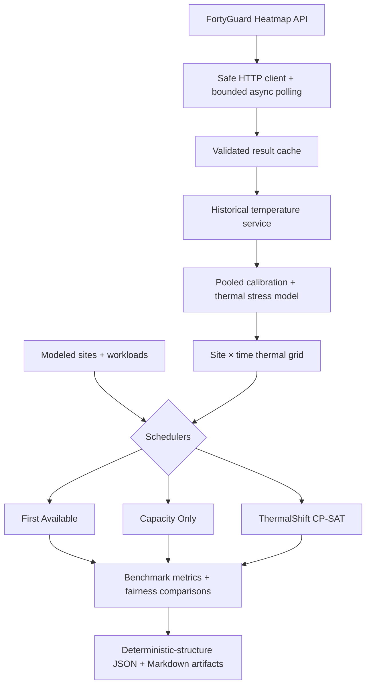

# ThermalShift AI

**Hyperlocal thermal-aware workload orchestration for distributed AI infrastructure.**

ThermalShift uses FortyGuard hyperlocal ambient-temperature data to model thermal stress around geographically distributed AI compute sites, then schedules flexible GPU workloads across sites and time windows while respecting capacity, release-time, deadline, duration, and placement constraints. It minimizes **modeled ambient thermal exposure**—not measured cooling energy or facility efficiency—and evaluates that choice against temperature-unaware schedulers.

> **FortyGuard Hackathon’26 project.** Primary alignment: **Track 03 — Industrial &
> Enterprise** and **Track 05 — Model Designing**.

## Live judge demo

**https://thermalshift-ai.onrender.com/**

The hosted product presents read-only official evidence plus an interactive
Scenario Lab that performs live scheduler recomputation against committed
FortyGuard historical conditions.

### Try it

1. Open the live demo.
2. Review the **Summer midday** primary evidence.
3. Open **ThermalShift Scenario Lab**.
4. Choose GPU demand, duration, time window, and eligible modeled sites.
5. Click **Run ThermalShift**.
6. Compare First Available, Capacity Only, and ThermalShift.
7. Inspect the site × time FortyGuard historical thermal landscape.

## The operational problem

Distributed AI operators can often choose where a batch, training, or evaluation workload runs and when it starts inside a release-to-deadline window. At the same orchestration period, eligible locations may experience materially different ambient thermal conditions.

Conventional placement policies prioritize available capacity, deadline feasibility, utilization, or locality. ThermalShift keeps those operational constraints and adds ambient temperature as another scheduling signal. It does **not** assume that hotter outdoor air directly determines GPU temperature, server inlet temperature, PUE, cooling energy, electricity use, or water consumption.

## What ThermalShift does

```text
FortyGuard temperature data
        ↓
historical ambient observations
        ↓
pooled P10/P90 calibration
        ↓
normalized thermal stress [0, 1]
        ↓
site × time thermal grid
        ↓
constraint-aware schedulers
        ↓
schedule decisions + benchmark evidence
```

For regularly sampled hourly slots, ThermalShift calculates:

```text
thermal exposure = Σ thermal_stress(site, time) × occupied hours
```

The aggregate unit is **thermal stress-hours**. This is an interpretable modeled decision metric, not an energy unit.

## FortyGuard is the environmental data layer

Historical collection uses the FortyGuard Heatmap API as an asynchronous, cache-first pipeline:

1. Submit `POST /v1/heatmap` using an API key sourced only from the environment.
2. Follow the returned activity through `GET /v1/status/{activity_id}`.
3. Apply the centralized finite polling policy: at most 120 status checks at five-second intervals.
4. Validate the completed response and use `stats_data.temperature_stats.mean` as the raw ambient-temperature observation.
5. Cache successful validated results to avoid duplicate submissions and support replay.

Collectors have explicit budgets for new Heatmap submissions; status GETs do not consume that submission budget. A timeout retains its activity ID for diagnosis, is not cached, and never triggers an automatic replacement POST. Calibration and replay observations pass through the same payload, response-validation, cache, and temperature-assessment pipeline. Credentials and raw `map_data` are not benchmark outputs.

**There is no synthetic fallback for an incomplete FortyGuard historical replay.** If required cache inputs are missing, the replay command exits nonzero, runs no benchmark, writes no evidence artifacts, and does not interpolate or fabricate temperatures.

### Request-time semantics

FortyGuard confirmed that Heatmap `date_time.start_time` is interpreted in the
AOI local time and that timezone and daylight-saving offset are inferred from
the polygon coordinates. ThermalShift therefore converts each requested
orchestration UTC instant into the modeled site local time before serialization.
Confirmed by the FortyGuard Hackathon Team on 2026-08-25.

## Modeled benchmark sites

These are modeled benchmark sites and capacities—not claims about specific real-world facilities, private infrastructure, or telemetry.

| Site ID | Modeled location | Coordinates | IANA timezone | Modeled GPU capacity |
|---|---|---:|---|---:|
| `ashburn-va` | Ashburn, Virginia | 39.0437, -77.4875 | `America/New_York` | 64 |
| `phoenix-az` | Phoenix, Arizona | 33.4484, -112.0740 | `America/Phoenix` | 64 |
| `san-antonio-tx` | San Antonio, Texas | 29.4241, -98.4936 | `America/Chicago` | 64 |
| `atlanta-ga` | Atlanta, Georgia | 33.7490, -84.3880 | `America/New_York` | 64 |

## Scheduling policies

All schedulers receive the same immutable sites, workloads, capacities, eligibility rules, and hourly thermal grid.

### First Available

A temperature-unaware baseline that chooses the earliest capacity-feasible start, using stable site order as its tie-break.

### Capacity Only

A temperature-unaware baseline that selects the placement with the largest minimum residual GPU capacity across occupied hours, then prefers earlier starts and stable site order.

### ThermalShift

An OR-Tools CP-SAT optimizer with a three-phase lexicographic objective:

1. Maximize the number of scheduled workloads.
2. Fix that completion optimum and minimize total modeled thermal exposure.
3. Fix both optima and minimize deterministic candidate rank.

Candidate placements must satisfy eligible-site membership, GPU capacity, release time, duration, deadline, and thermal-grid availability. Aggregate overlapping demand cannot exceed a site’s modeled capacity. Workload priority exists in the domain model but is **not** an optimization objective in the current implementation.

## Architecture



## Evidence and simulation classification

### Synthetic demonstration — not FortyGuard benchmark evidence

The repository includes a deterministic synthetic thermal grid for verifying scheduler behavior offline. Running `python examples/run_synthetic_benchmark.py` in this checkout produced:

| Scheduler | Scheduled | Completion | Deadline satisfaction | Total exposure (stress-hours) | Mean occupied stress | Peak occupied stress |
|---|---:|---:|---:|---:|---:|---:|
| First Available | 8/8 | 100.0% | 100.0% | 10.300 | 0.792 | 0.860 |
| Capacity Only | 8/8 | 100.0% | 100.0% | 9.220 | 0.709 | 0.940 |
| ThermalShift | 8/8 | 100.0% | 100.0% | 2.560 | 0.197 | 0.260 |

Because all three schedulers placed the same workload-ID set and preserved deadline satisfaction, the existing fairness gate permits direct comparison. In this synthetic demonstration, ThermalShift reduced modeled thermal exposure by **75.1% versus First Available** and **72.2% versus Capacity Only**.

These percentages demonstrate optimizer behavior on synthetic thermal scores. They are not FortyGuard benchmark evidence and are not claims about electricity, cooling energy, water, PUE, or real facility savings. Runtime is recorded as observational metadata but is not presented as a competitive result.

### A. Official historical benchmark evidence

The committed, predeclared summer and winter FortyGuard historical replays are the
official hackathon evidence. They are separate from Scenario Lab results.

The separate cache-only replay path uses FortyGuard historical ambient temperatures, the frozen pooled P10/P90 calibration rule, ten modeled workloads, modeled 64-GPU site capacities, and identical constraints across schedulers. Two six-hour, one-hour-resolution windows were fixed before viewing their full hourly outcomes:

- `summer-midday-v1`: 2024-07-15 18:00Z through 23:00Z
- `winter-overnight-v1`: 2024-01-15 06:00Z through 11:00Z

Predeclaring the windows and workloads reduces cherry-picking risk. The replay
runner still refuses to benchmark any window whose frozen calibration or replay
inputs are incomplete.

Both predeclared replay windows are now complete. Each scheduler received the
same four modeled sites, modeled 64-GPU capacities, ten modeled workloads, and
temperature-derived grid. All three schedulers placed the identical `w01`–`w10`
workload set with 100% deadline satisfaction.

| Window | First Available | Capacity Only | ThermalShift | Result |
|---|---:|---:|---:|---|
| `summer-midday-v1` | 16.592 stress-hours | 16.253 stress-hours | 13.262 stress-hours | 20.1% lower vs First Available; 18.4% lower vs Capacity Only |
| `winter-overnight-v1` | 0.152 stress-hours | 0.168 stress-hours | 0.000 stress-hours | ThermalShift reached the modeled thermal-stress floor |

**Primary historical result:** On the predeclared summer historical replay,
ThermalShift reduced modeled ambient thermal exposure by **20.1% versus First
Available** and **18.4% versus Capacity Only** while scheduling all 10 workloads
and preserving 100% deadline satisfaction.

**Winter interpretation:** ThermalShift reached the modeled thermal-stress floor
at 0.000 stress-hours against small positive baseline exposures of approximately
0.152 and 0.168 stress-hours. The raw 100% relative modeled reduction reflects
that floor; it does not mean 100% cooling, energy, electricity, water, or facility
savings.

Committed evidence:

- Summer: [judge-facing report](evidence/summer-midday-v1/report.md) and
  [machine-readable JSON](evidence/summer-midday-v1/benchmark.json)
- Winter: [judge-facing report](evidence/winter-overnight-v1/report.md) and
  [machine-readable JSON](evidence/winter-overnight-v1/benchmark.json)

## B. Interactive Scenario Lab — not official benchmark evidence

Scenario Lab adds exactly one modeled `whatif` workload to the existing ten-workload
replay scenario, then executes the real backend implementations of First Available,
Capacity Only, and ThermalShift CP-SAT. It recomputes scheduler decisions and the
existing fairness comparisons for every request; it is not a browser calculator and
does not return precomputed benchmark placements.

Interaction makes **zero FortyGuard requests**. The service loads committed,
sanitized FortyGuard historical temperature and modeled-stress inputs. Results are
ephemeral interactive simulations and are never written into official evidence.

The bounded endpoint is:

```http
POST /api/scenario
Content-Type: application/json
```

```json
{
  "window_id": "summer-midday-v1",
  "gpu_demand": 16,
  "duration_hours": 2,
  "release_offset_hours": 0,
  "deadline_offset_hours": 4,
  "eligible_site_ids": [
    "ashburn-va",
    "phoenix-az",
    "san-antonio-tx",
    "atlanta-ga"
  ]
}
```

The public supporting artifacts are:

- [`evidence/summer-midday-v1/thermal_grid.json`](evidence/summer-midday-v1/thermal_grid.json)
- [`evidence/winter-overnight-v1/thermal_grid.json`](evidence/winter-overnight-v1/thermal_grid.json)

They are classified as **public interactive simulation inputs**, not new benchmark
results. Each contains four modeled sites × six UTC hours, FortyGuard historical AOI
mean ambient temperature, the derived modeled thermal-stress score, and frozen
calibration provenance. They contain no credentials, activity IDs, raw API payloads,
polygons, `map_data`, or private cache metadata.

## Calibration and thermal model

Calibration pools historical FortyGuard observations across all four modeled locations onto one shared scale. The frozen replay rule is:

```text
lower reference = pooled P10
upper reference = pooled P90

raw stress = (temperature - lower reference) / (upper reference - lower reference)
stress = clamp(raw stress, 0, 1)
```

P10 and P90 are model calibration references, not universal physical safety thresholds. Shared references make site and scheduler comparisons use the same interpretation of ambient thermal stress.

The frozen set is complete at **28/28 observations**. Its pooled references are
**4.567570294117648 °C (P10)** and **37.01878625 °C (P90)**.

## Evidence classification

| Evidence | Temperature input | Workloads | Site capacity | Claim level |
|---|---|---|---|---|
| Synthetic demonstration | Synthetic thermal-stress grid | Modeled | Modeled | Optimizer behavior only; not FortyGuard evidence |
| FortyGuard historical replay | FortyGuard historical ambient temperatures | Modeled | Modeled | Official historical benchmark evidence, only when cache inputs are complete |
| Scenario Lab | Committed sanitized FortyGuard historical inputs | One added modeled workload | Modeled | Interactive simulation; not official benchmark evidence |

This distinction is also embedded in generated JSON and Markdown artifacts.

## Quickstart

Requires Python 3.12. From a local clone:

```bash
cd thermalshift-ai
python -m venv .venv
source .venv/bin/activate
python -m pip install -e ".[dev]"
```

Run the offline synthetic demonstration:

```bash
python examples/run_synthetic_benchmark.py
```

Generate judge-readable evidence artifacts:

```bash
python examples/run_synthetic_benchmark.py \
  --output-dir runs/synthetic-demo
```

This writes `benchmark.json` and `report.md`. Run the offline quality checks with:

```bash
python -m pytest
python -m ruff check .
```

## Live demo locally

Start the judge-facing application from the repository root:

```bash
python -m uvicorn thermalshift.web.app:app \
  --host 0.0.0.0 \
  --port 8000
```

Open <http://localhost:8000>. The application presents committed summer and winter
official evidence plus Scenario Lab. Interactive requests run the scheduler suite
locally against the sanitized committed grids and make no FortyGuard request.

### Deploy on Render

Render deploys the FastAPI service directly from this repository using the
configuration in `render.yaml`. Python is pinned to 3.12 by `.python-version`, and
Render checks service health at `/healthz`. The deployed application reads committed
official evidence and public simulation-input grids, so the judge demo does not need
a FortyGuard credential.

## Cache-only historical replay

Run a selected replay from existing validated cache records:

```bash
python examples/run_historical_replay.py \
  --window summer-midday-v1
```

Write artifacts only if the replay is complete:

```bash
python examples/run_historical_replay.py \
  --window summer-midday-v1 \
  --output-dir runs/summer-midday-v1
```

This runner never collects missing data or makes a synthetic substitution. Collection is intentionally separate, confirmation-gated, budget-bounded, and omitted from the primary quickstart to avoid accidental API-credit use.

## Reproducibility and fairness

For identical inputs, scenario definitions, scheduling decisions, modeled thermal metrics, fairness comparisons, site/workload ordering, and artifact structure/key ordering are deterministic. The fairness layer publishes a direct thermal reduction percentage only when candidate and baseline schedule exactly the same workload-ID set; a missing percentage remains `null`, and negative reductions are retained.

`runtime_ms` is measured execution metadata and may vary by machine or run. An optional `generated_at_utc` is also metadata. Historical replay additionally depends on the exact validated FortyGuard responses present in the local cache, so production artifacts are not claimed to be byte-identical across executions.

## Scientific boundaries

| ThermalShift does measure or model | ThermalShift does not establish |
|---|---|
| FortyGuard ambient-temperature observations | GPU temperature |
| Normalized modeled ambient thermal stress | Server inlet temperature |
| Thermal stress-hours for workload placement | PUE or cooling energy |
| Relative scheduler comparisons under controlled inputs | Electricity consumption or electricity savings |
|  | Water consumption or water savings |
|  | Facility savings |

Facility-level outcomes would require facility telemetry and a separately validated physical model.

## Project structure

```text
thermalshift/fortyguard/  API client, polling, validation, cache, historical service
thermalshift/thermal/     Calibration diagnostics and thermal stress model
thermalshift/scheduler/   Baselines, shared constraints, and CP-SAT optimizer
thermalshift/benchmark/   Metrics, comparisons, runner, and evidence artifacts
thermalshift/replay/      Fixed windows, modeled workloads, and cache-only adapters
thermalshift/web/         Judge dashboard and live bounded Scenario Lab service
evidence/                 Official evidence plus classified public simulation inputs
examples/                 Offline runners and guarded collection/diagnostic tools
tests/                    Offline unit and integration-style tests
docs/                     Methodology and integration documentation
```

## Why this is useful

ThermalShift demonstrates how distributed AI infrastructure operators, batch/training platform teams, and infrastructure researchers can incorporate hyperlocal ambient-temperature intelligence into workload placement alongside capacity and deadlines. FortyGuard data is an operational input to constraint-aware scheduling—not a decorative dashboard—and same-workload fairness checks prevent a scheduler from appearing thermally better merely by dropping difficult work.

The architecture could later incorporate facility telemetry, carbon intensity, electricity pricing, queueing objectives, or forecast data. Those are future extensions, not current capabilities or measured outcomes.

## Design principles

- FortyGuard ambient data drives scheduling decisions rather than visualization alone.
- Optimization respects operational constraints; it does not simply “choose the coolest city.”
- Completion is optimized before thermal exposure.
- Thermal percentages require the same scheduled workload set.
- Missing historical data is never replaced with fabricated evidence.
- Evidence artifacts visibly distinguish synthetic demonstrations from FortyGuard-backed replay.
- API collection is cache-first, finite, and submission-budgeted.

## Documentation

- [Historical data collection and FortyGuard integration](docs/historical_data.md)
- [Historical replay methodology](docs/historical_replay.md)
- [Benchmark methodology and evidence artifacts](docs/benchmarking.md)
- [Scheduling model](docs/scheduling.md)
- [Thermal stress model](docs/thermal_model.md)
